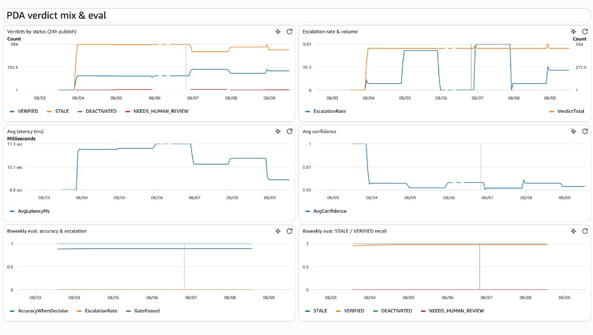

# Don’t ask an AI if a provider listing is “correct”

If you work with provider directories long enough, you stop trusting the spreadsheet.

Same clinician, two cities. An address that was right three years ago and never got cleaned up. A name that almost matches the registry — close enough that a human squints, far enough that automation shouldn’t shrug and move on. Inactive NPIs that still show up as if nothing happened.

The scale makes it worse. Manual review doesn’t keep up. So someone eventually suggests the obvious shortcut: hand each row to a language model and ask whether it looks right.

That sounds reasonable until you watch it fail. Models are good at sounding sure. In this workflow, a fluent wrong answer is worse than silence — someone might publish it.

So instead of asking for an opinion, give the model a job with tools: check the NPI, pull the registry, compare the address, then return a structured verdict with the evidence attached. If it can’t get there cleanly, escalate.

That’s the pattern this piece walks through. Code lives here: [`agent/`](agent/), [`samples/`](samples/), [`evals/`](evals/).

---

## 1. What the agent does

Health plans have to keep directories accurate. CMS audits still catch a lot of bad rows — moved practices, wrong addresses, deactivated NPIs.

This agent handles the first pass. For each directory record it gathers evidence from authoritative sources and returns one of:

- `VERIFIED`
- `STALE`
- `DEACTIVATED`
- `NEEDS_HUMAN_REVIEW`

```text
messy directory row
        │
        ▼
agent picks tools as it goes
  · check_npi_format
  · lookup_npi_registry (NPPES)
  · validate_practice_address
  · match_provider_name
  · compare_practice_addresses
        │
        ▼
Verdict {status, confidence, rule_path, evidence}
```

After that, a thin policy layer decides whether the label is trusted enough to keep, or whether it should flip to human review. That lives in [`agent/reconcile.py`](agent/reconcile.py). The loop the model actually runs is in [`agent/tools/llm.py`](agent/tools/llm.py); the tools it can call are in [`agent/tools/agent_tools.py`](agent/tools/agent_tools.py).

---

## 2. Built with AWS Strands

The investigation is a Strands agent: the model chooses tools, reads what comes back, and keeps going until it can emit a structured verdict.

Strands is an open-source agents SDK (originally from AWS) built for this shape of work — tools, a model, and a typed outcome.

- Docs: [https://strandsagents.com/](https://strandsagents.com/)
- Intro: [Introducing Strands Agents (AWS Open Source Blog)](https://aws.amazon.com/blogs/opensource/introducing-strands-agents-an-open-source-ai-agents-sdk/)

Three pieces matter in code:

1. A system prompt that defines the job and what each verdict means  
2. The tool list the model is allowed to call  
3. A structured output schema (`VerdictOutput`) for the final decision  

```python
# Shape from agent/tools/llm.py
agent = Agent(
    model=...,
    system_prompt=SYSTEM_PROMPT,
    tools=RECONCILIATION_TOOLS,
)
result = agent(prompt, structured_output=VerdictOutput)
```

The model isn’t inventing the registry. It’s using tools, then judging from what those tools returned.

Start in [`agent/tools/llm.py`](agent/tools/llm.py) for the prompt, schema, and loop. Registry lookup sits behind [`agent/tools/nppes.py`](agent/tools/nppes.py).

---

## 3. What “messy” looks like in practice

Public CMS-style directory data is full of near-misses: suite numbers, suppressed address lines, multiple locations under one NPI, rows that look related but aren’t.

These are real-shaped examples from a working run (public NPIs). Full fixtures are in [`samples/`](samples/).

### Same NPI, two practice locations

One NPI (`1003820432`) shows up at two addresses:

| Directory address | Verdict | Why |
|---|---|---|
| 593 Eddy St, Providence, RI | `VERIFIED` (0.99) | Practice location matches NPPES |
| 45 Wells St Suite 104, Westerly, RI | `STALE` (0.95) | Same NPI still active; Westerly isn’t in NPPES locations |

That’s the core problem: the identifier is fine, the location isn’t. A second NPI (`1003821828`) does the same dance — Bronx matches, Mount Vernon doesn’t — even when ZIP formatting is noisy on the good row.

### Identity conflict that shouldn’t auto-resolve

Sometimes the directory and the registry disagree on more than an address. One Manhasset row (NPI `1003582156`) carries a last name that doesn’t match what NPPES returns for that NPI, and the registry location is in a different city entirely.

That’s not a safe automatic `STALE` or `VERIFIED`. It becomes `NEEDS_HUMAN_REVIEW`.

### Clean match

And sometimes everything lines up: active NPI, name match, practice address match. One Providence row (NPI `1003049883`) comes back `VERIFIED` (1.0) after the full trail — NPI → NPPES → name → address.

Inputs and outputs for these cases: [`samples/messy_inputs.json`](samples/messy_inputs.json), [`samples/verdict_outputs.json`](samples/verdict_outputs.json).

---

## 4. Confidence and the eval harness

### Confidence comes from the judge, not a score formula

Each verdict includes `confidence` from `0.0` to `1.0`. The model reports that number after it’s seen the tool results — LLM-as-judge over evidence, not a weighted blend of name/address scores in application code.

That means calibration follows the model. Smaller local models are often poorly calibrated; stronger hosted models usually do better, but it’s still a judgment call, not a sensor reading.

### Confidence floor (fail closed)

Policy in [`agent/reconcile.py`](agent/reconcile.py):

```python
LLM_CONFIDENCE_FLOOR = 0.6

if result.confidence < LLM_CONFIDENCE_FLOOR:
    # keep the model's reason/evidence, but do not trust the label
    return NEEDS_HUMAN_REVIEW  # rule_path = strands:low_confidence
```

In the fixtures, a conflict case at confidence `0.15` is stored as `NEEDS_HUMAN_REVIEW` with `strands:low_confidence` — even when the narrative already smelled wrong.

### Eval harness (the real quality check)

Self-reported confidence isn’t enough. A golden set of labeled listings is scored offline:

- escalation rate  
- accuracy when decisive  
- recall for important labels like `STALE`  
- a gate that fails the run if recall drops too far  

```bash
python -m evals.run
```

Scoring lives in [`evals/run.py`](evals/run.py); sample labels in [`evals/golden.sample.jsonl`](evals/golden.sample.jsonl). The floor itself is in [`agent/reconcile.py`](agent/reconcile.py).

---

## 5. What it looks like in ops

When the same pattern runs as a fuller stack, the agentic loop’s outcomes show up in CloudWatch: verdict mix over time, escalation rate vs volume, average latency, average confidence (LLM-as-judge), plus a biweekly eval panel for accuracy when decisive and recall on labels like `STALE` / `VERIFIED`.



That’s the point of measuring offline too — live confidence and latency tell you how the agent is behaving; the eval gate tells you whether the labels are still trustworthy.

---

## 6. Where to look in the repo

If you want to follow the idea in code, this order works:

```text
1. agent/tools/llm.py          Strands loop, prompt, VerdictOutput
2. agent/tools/agent_tools.py  tools the model may call
3. samples/                    messy rows + real-shaped verdicts
4. agent/reconcile.py          confidence floor / fail-closed policy
5. evals/                      golden-sample scoring
```

Supporting pieces: [`core/models.py`](core/models.py) for `Provider` / `Verdict` shapes, [`agent/tools/nppes.py`](agent/tools/nppes.py) for the registry contract, [`README.md`](README.md) for a shorter file map.

---

### Data note

Examples use publicly available CMS-style provider directory fields and the public NPPES registry. This is an independent learning/prototype pattern, not a CMS system or endorsement.
